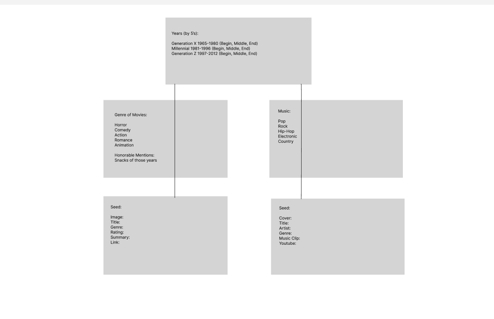
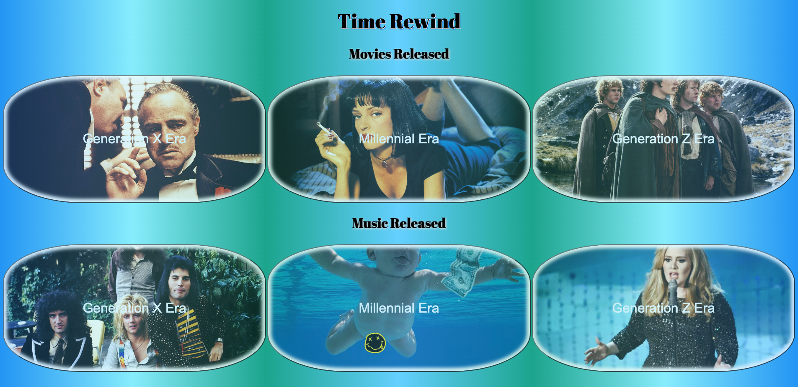

# Title: 
**User Story:** As we get older we are constantly experiencing new things and gaining new memories. What about the old? Well those memories tend to fade but when they are triggered we tend to relive those moments. This webpage is purely being created so we can rememeber. Our OWN memory history - a history of our youth and what we grew up listening to and watching. I hope you enjoy the walk down memory lane!

## Personal Daily Schedule and Goals:
1. Friday - Create all files, try to get skeleton built in the model & seeds
2. Saturday - Finish seeding data, Getting setup for express
3. Sunday - God even rests
4. Monday - Work on the controllers and focus on CRUD
5. Tuesday - Set up the HTML page, add the needed client functions in our index.js.
6. Wednesday - Begin CSS on the main page
7. Thursday - Make sure pages are communicating and wrap up finishing touches in CSS.

### Technologies used:
1. Javascript
2. CSS
3. HTMl
5. Mongoose
6. Express.js
7. Cors
8. Axios/Api
9. ThunderClient
10. Morgan & Body-Parser

### Steps to making the code:
1. Spend time whiteboarding, coming up with what information you want displayed on your page, and what your seed files will need to look like.
2. Think about the functionability of the page to help you design your wireframe.
2. Create an wireframe outline for your webpage.
3. Start with creating a repo in your github and cloning the file into your terminal.
4. After creating the file in your terminal we will begin installing the software we will be implementing.
5. Look to your wireframing and design to create the files we will need to seed the code.
6. Proceed with connecting all models, to seeds, to controllers and making sure they are communicating with one another.
7. Create CRUD functions on our backend and begin creating our frontend files.
8. Link the frontend files accordingly and have them extract the data from our backend.
9. Beginning adding functions to our front end that allow us to target our backend.
10. Make the functions concise and run them in the terminal to check their function.
11. After checking that the pages are operating the way desired and the correct data is being pulled clean up any unused code.

## Features & Possible Future Enhancements:
**Current features:**
1. Allows users to see all the current data organized by year and defined by type, music or movie.
2. Buttons added to toggle between pages.
3. Links connected to both group types carrying the user to the music videos and watch trailers.

**Possible Future Enhancements:**
* Adding buttons that allow you to search by genre on the corresponding HTML page.
* Adding a scrolling feature to the return home button so it follows the user down the page.
* Adding a way for users to signin and leave a rating, plus allow them to log what they've seen. (Like a check off list)
* Adding a submission area to allow users to add movies/music to the lists.

## Attributions & Resources:
1. Images sourced via google search, links provided in code.
2. Music videos and movie trailers linked via youtube. 
3. Buttons and Windows code referenced from https://www.w3schools.com/js/js_window_location.asp
4. A mixture of referencing old code, w3schools, and chatgpt for creation of functions.
5. CSS editing:
    * https://www.w3schools.com/css/css3_gradients.asp (referenced for gradients)
    * https://getcssscan.com/css-buttons-examples (referenced for return button) *** There is a lot of cool unique code there ***
    * https://unused-css.com/tools/box-shadow-generator?p=21EYcwvMAMAEMIyQA4A9oFYXQMQBYAcAhsAKaQA0MMATEqgOyZbEkDGLBFs0VGqNjhKiSqcYAZlrde2AGYy4OAJxigA & https://www.w3schools.com/css/css3_shadows.asp (referenced for shadows)

# Finished product screenshot:

